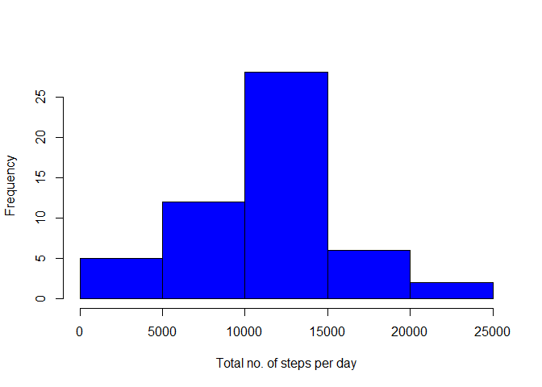
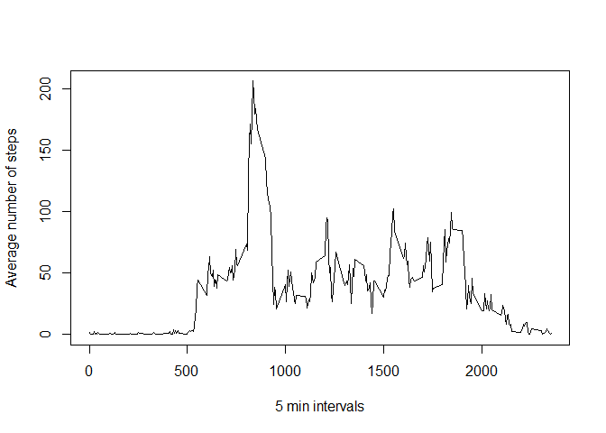
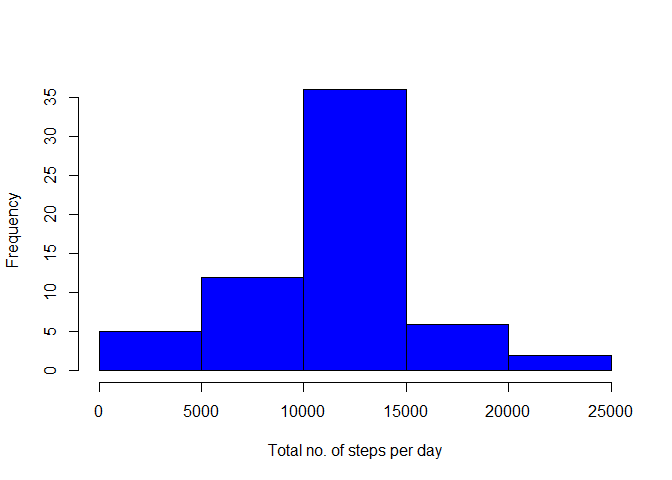
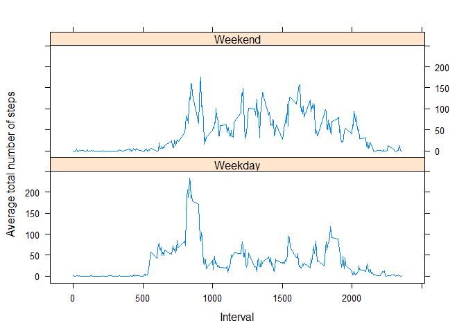

***

## Loading and preprocessing the data


```r
setwd("~/Coursera/Data science with R spec/Notes from R course/repdata_data_activity")
activity <- read.csv("activity.csv", header = T)
```

## What is mean total number of steps taken per day?

```r
dat <- na.omit(activity)
datmean <- aggregate(dat$steps, by = list(Category = dat$date), FUN = mean)
datsum <- aggregate(dat$steps, by = list(Category = dat$date), FUN = sum)
datmedian <- aggregate(dat$steps, by = list(Category = dat$date), FUN = median)
```

Histogram of the total number of steps taken each day

```r
hist(datsum$x, col = "Blue", xlab = "Total no. of steps per day", main = "")
```

<!-- -->

Mean total steps per day 

```r
mean(datsum$x)
```

```
## [1] 10766.19
```

Median total steps per day 

```r
median(datsum$x)
```

```
## [1] 10765
```


## What is the average daily activity pattern?#
The average number of steps taken across all days for each 5-minute interval.


```r
intervals <- aggregate(dat$steps, by = list(Category = dat$interval), FUN = mean)

plot(intervals$Category, intervals$x, type = "l", xlab = "5 min intervals", ylab = "Average number of steps")
```

<!-- -->

The 5-minute interval which contained the highest average number of steps across all days.

```r
intervals[which.max(intervals$x),1]
```

```
## [1] 835
```

## Imputing missing values
The total number of missing values in the dataset

```r
sum(is.na(activity[1]))
```

```
## [1] 2304
```

Filling in the missing values from the data set by the mean of the corresonding 5-minute interval. 

```r
StepsAvrg <- aggregate(steps ~ interval, data = activity, FUN = mean)
fillNA <- numeric()
for (i in 1:nrow(activity)) {
        rec <- activity[i, ]
        if (is.na(rec$steps)) {
                steps <- subset(StepsAvrg, interval == rec$interval)$steps
        } else {
                steps <- rec$steps
        }
        fillNA <- c(fillNA, steps)
}

activity1 <- activity
activity1$steps <- fillNA
```

Histogram of the total number of steps taken each day 

```r
Total_steps <- aggregate(steps ~ date, data = activity1, sum, na.rm = TRUE)
hist(Total_steps$steps, col = "Blue", xlab = "Total no. of steps per day", main = "")
```

<!-- -->

Mean total steps per day

```r
mean(Total_steps$steps)
```

```
## [1] 10766.19
```
Median total steps per day

```r
median(Total_steps$steps)
```

```
## [1] 10766.19
```

Do these values differ from the estimates from the first part of the assignment? 
Yes, the median value has decreased 1.19 steps when compared with the data set with NA rows removed. 


##Are there differences in activity patterns between weekdays and weekends?

First I created a new factor variable in the datset with two levels -- "weekday" and "weekend"


```r
activity1$date <- as.Date(activity1$date, "%Y-%m-%d")
day <- weekdays(activity1$date)

dtype <- vector()
for (i in 1:nrow(activity)) {
        if (day[i] == "Saturday") {
                dtype[i] <- "Weekend"
        } else if (day[i] == "Sunday") {
                dtype[i] <- "Weekend"
        } else {
                dtype[i] <- "Weekday"
        }
}
activity$dtype <- dtype
activity$dtype <- factor(activity$dtype)

steps_Dtype <- aggregate(steps ~ interval + dtype, data = activity, mean)
names(steps_Dtype) <- c("interval", "dtype", "steps")
```

A panel plot containing a time series plot of the 5-minute interval (x-axis) and the average number of steps taken, averaged across all weekday days or weekend days (y-axis)


```r
library(lattice)
xyplot(steps ~ interval | dtype, steps_Dtype, type = "l", layout = c(1, 2), 
       xlab = "Interval", ylab = "Average total number of steps")
```

<!-- -->


